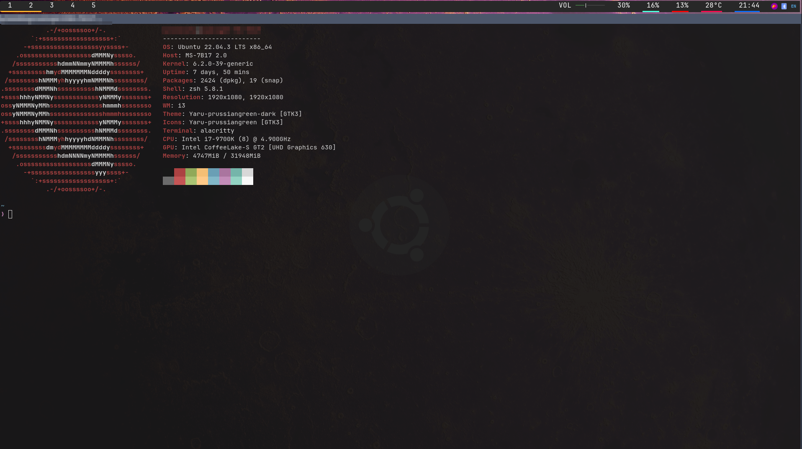

# Dotfiles Configuration (Debian)

This repository contains my personal configuration files (dotfiles) for various applications and tools I use with Ubuntu.

# Preview



# Features

### Alacritty

A GPU-accelerated terminal emulator. Please see [Alacritty Cargo Installation](https://github.com/alacritty/alacritty/blob/master/INSTALL.md) before using Alacritty as it won't work without cargo

### i3

Tiling window manager

### i3lock

Screen locker

### Polybar

Easy to use tool for creating status bars

### Neovim

**NOTE**: I am working on a submodule script and cloning this bare repo will not setup my neovim configuration. However, the repo is publically available here [VIM Disel](https://github.com/AntoninoAdornetto/vim-diesel-kickstart)

### Zsh

Extended version of the Bourne Shell (sh), with many improvements and features

### Tmux

Terminal multiplexer for Unix-like operating systems.

# Setup Guide

This repository uses a [Git bare repository](https://www.theserverside.com/blog/Coffee-Talk-Java-News-Stories-and-Opinions/What-is-a-bare-git-repository)

### Cloning the Dotfiles

1. **Define an Alias in your current Shell Session**

```sh
alias config='/usr/bin/git --git-dir=$HOME/dotfiles/ --work-tree=$HOME'
```

This alias will allow you to run git commands against the dotfiles repo as if it were a regular git repo.

2. **Prevent Untracked Files from Showing up**
   To avoid conflicts with the files already in your home directory and to prevent untracked files from showing up, use the following command:

```sh
echo "dotfiles" >> .gitignore
```

3. **Clone the Dotfiles**

```sh
git clone --bare https://github.com/AntoninoAdornetto/dotfiles $HOME/dotfiles
```

4. **Checkout the Contents from Repo**

The below command will use the alias we defined earlier and tell git to take the contents of the bare repo (the dotfiles) and populate them into your home directory (`$HOME`). It essentially materializes the dotfiles where they are meant to be used.

```sh
config checkout
```

5. **Set Git to Ignore Untracked Files**

We use our alias again to tell git to ignore untracked files. This will make life easier.

```sh
config config --local status.showUntrackedFiles no
```

6. **Use the Alias**

You don't have to worry about adding the alias to your `.bashrc` or `.zshrc` file. It is done for you already after cloning and checkout.

7. **Submodules (TODO)**

Cloning a bare repo with submodules is a bit tricky and can be error prone. Reason being, you have to manually clone each submodule into the correct location and know where each submodule is supposed to be located.

I am working on a script for this and will update the README once it's ready.

# New System Setup Script

Setting up a new system can be time consuming. To streamline this process, I have created a shell script that automatically installs the essential packages and configures the environment.

### Prerequisites

Before running the script, ensure that:

- You have a Debian-based Linux distribution (like Ubuntu) since the script uses APT for package installation.
- You have `sudo` privileges on your system

### Using the New System Setup Script

1. **Navigate to the Script**:

```sh
cd Scripts
```

3. **Make the Script Executable**:

```sh
chmod +x new-system-setup.sh
```

4. **Execute the Script**:

```sh
sudo ./new-system-setup.sh
```

This will install [i3](https://github.com/i3/i3) [i3lock](https://github.com/i3/i3lock) [polybar](https://github.com/polybar/polybar) [neofetch](https://github.com/dylanaraps/neofetch) [nitrogen](https://github.com/l3ib/nitrogen) [ripgrep](https://github.com/BurntSushi/ripgrep) [flameshot](https://github.com/flameshot-org/flameshot) and zsh
